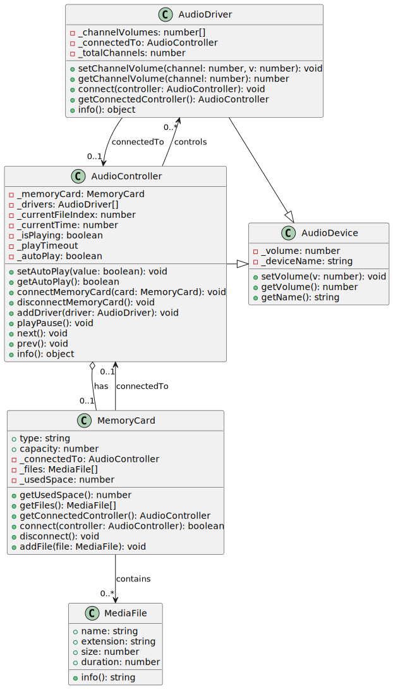

# JS-for-beginners_audio-player

_Created for the course "JS-for-beginners" V. N. Karazin Kharkiv National University_

Audio system simulation in JS (ECMAScript 5)

---

## Independent Project

The goal of this project is to design software architecture that simulates a **Smart Audio System** for use in a "Smart Home" environment. The system models the interaction of audio components including a controller, memory card, media files, and audio drivers (speakers, headphones, etc.).

## Key Features

-   Developed using **ECMAScript 5** (ES5) only.
-   Implements a fully **object-oriented approach**, including:

    -   **Encapsulation**
    -   **Inheritance**
    -   **Polymorphism**
    -   **Prototype-based object creation**
    -   **Aggregation and Association**

-   Asynchronous behavior is modeled via **callback-based logic** in the `playPause` method using `setTimeout`.

## Components Modeled

At least three distinct types of smart components are implemented:

1. **MediaFile** – represents an audio file (aggregation to memory card).
2. **MemoryCard** – stores multiple media files (aggregated to AudioController).
3. **AudioDriver** – represents an output device (e.g., speakers).
4. **AudioController** – orchestrates the entire system (aggregates MemoryCard and AudioDrivers).

## Architecture Summary (UML Overview)



## How to Use

```javascript
// Create media files
var song1 = new MediaFile("SongOne", ".mp3", 5, 10);
var song2 = new MediaFile("SongTwo", ".mp3", 7, 12);

// Insert them into a memory card
var card = new MemoryCard("SD", 20);
card.addFile(song1);
card.addFile(song2);

// Create audio controller
var controller = new AudioController("MainController", [".mp3", ".wav"], 2);

// Connect memory card and drivers
controller.connectMemoryCard(card);
controller.addDriver(new AudioDriver("FrontSpeaker", 2));
controller.addDriver(new AudioDriver("BackSpeaker", 2));

// Play songs
controller.playPause();
```

Read more in the Tests section of audioController.js
